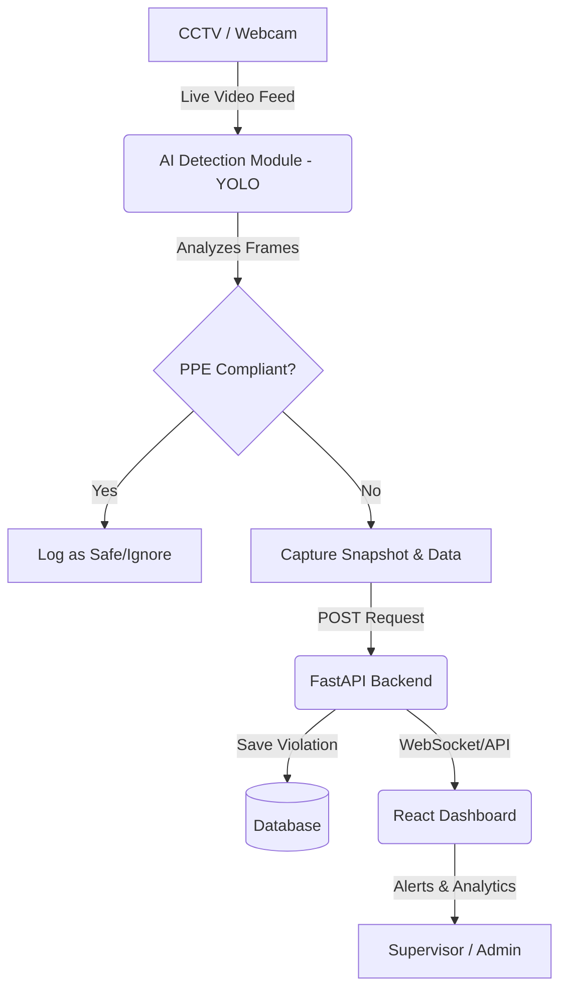

# Project Report: AI-Based Industry Safety Management System

## 1. Abstract
The "AI-Based Industry Safety Management System" is an advanced automated surveillance solution designed under the Industry 4.0 & Industry 5.0 domain. It leverages Computer Vision and Deep Learning (YOLO) to monitor factory workers in real-time, ensuring compliance with safety regulations. The system automatically detects whether workers are wearing essential Personal Protective Equipment (PPE) such as safety helmets, vests, face masks, gloves, and safety shoes. Non-compliance triggers immediate alerts, logs violations into a centralized database, and displays them on a live web dashboard, thereby drastically reducing the risk of workplace accidents and enhancing overall industrial safety.

## 2. Problem Statement
In industrial environments, failure to wear required PPE is a leading cause of severe injuries and fatalities. Traditional safety monitoring relies heavily on manual supervision, which is prone to human error, fatigue, and is practically impossible to scale continuously across large facilities. There is a critical need for an automated, intelligent system that can persistently monitor the workforce, instantly detect safety violations, and alert supervisors without manual intervention.

## 3. Objectives
- To develop an AI-powered system capable of real-time PPE detection using CCTV or webcam feeds.
- To detect specific safety gear: Helmets, Vests, Masks, Gloves, and Shoes.
- To store violation data (timestamp, camera ID, snapshot) in a secure database.
- To provide a web-based dashboard for supervisors to view live feeds, alerts, and analytics.
- To generate daily, weekly, and monthly compliance reports.

## 4. Literature Survey
Recent advancements in Deep Learning, particularly Convolutional Neural Networks (CNNs) and the YOLO (You Only Look Once) family of models, have made real-time object detection highly accurate and efficient. Studies have shown that YOLO models can be deployed on edge devices to detect PPE in manufacturing plants with over 90% accuracy. Previous systems often focused on single PPE items (like just helmets); this project aims to provide a comprehensive, multi-class detection system combined with a robust web architecture for enterprise management.

## 5. Proposed System
The proposed system integrates an AI inference module with a web application backend and frontend:
- **AI Module:** Captures video frames, processes them using a custom-trained YOLO model, and identifies workers and their PPE.
- **Backend:** A FastAPI-based REST server that receives violation events from the AI module, saves them in a database, and serves data to the frontend.
- **Frontend:** A React.js dashboard providing real-time statistics, violation history, and user management.

## 6. System Architecture & Block Diagram

## 7. Flowchart
1. Start System.
2. Initialize Camera Feed.
3. Read Frame.
4. Detect Persons in Frame.
5. For each Person, detect (Helmet, Vest, Mask, Gloves, Shoes).
6. Check against required rules.
7. If missing required PPE -> Generate Violation Event.
8. Save to DB via Backend API.
9. Update Frontend Dashboard.
10. Loop back to Step 3.

## 8. Database Schema
- **Users Table:** id, username, password_hash, role
- **Workers Table:** id, name, department, employee_id
- **Cameras Table:** id, location, stream_url, status
- **Violations Table:** id, camera_id, timestamp, missing_ppe_list, image_path, status
- **Alerts Table:** id, violation_id, is_read, created_at

## 9. Testing Plan
- **Unit Testing:** Test backend API endpoints using Pytest.
- **Integration Testing:** Verify data flows correctly from the AI module to the backend and reflects on the frontend.
- **Model Evaluation:** Measure YOLO model mAP (mean Average Precision), Precision, and Recall on a validation dataset.
- **User Acceptance Testing (UAT):** Have a supervisor use the dashboard to generate a report and view live alerts.

## 10. Future Scope
- **Facial Recognition:** To automatically identify which specific worker committed the violation.
- **Edge Deployment:** Running the AI model on edge devices (like NVIDIA Jetson) to reduce network bandwidth.
- **Predictive Analytics:** Using historical data to predict which zones or shifts are most prone to safety violations.

## 11. Conclusion
The AI-Based Industry Safety Management System provides a scalable, automated, and highly reliable approach to enforcing workplace safety. By minimizing reliance on manual monitoring, the system ensures real-time compliance, ultimately saving lives and reducing industrial liabilities.
